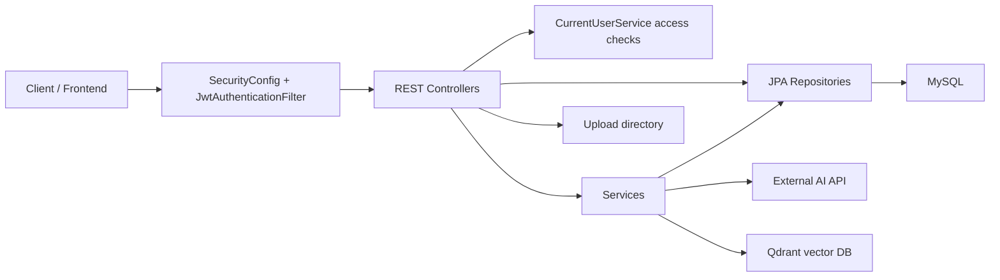
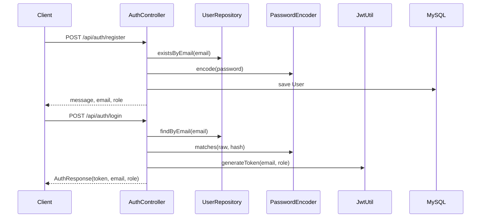
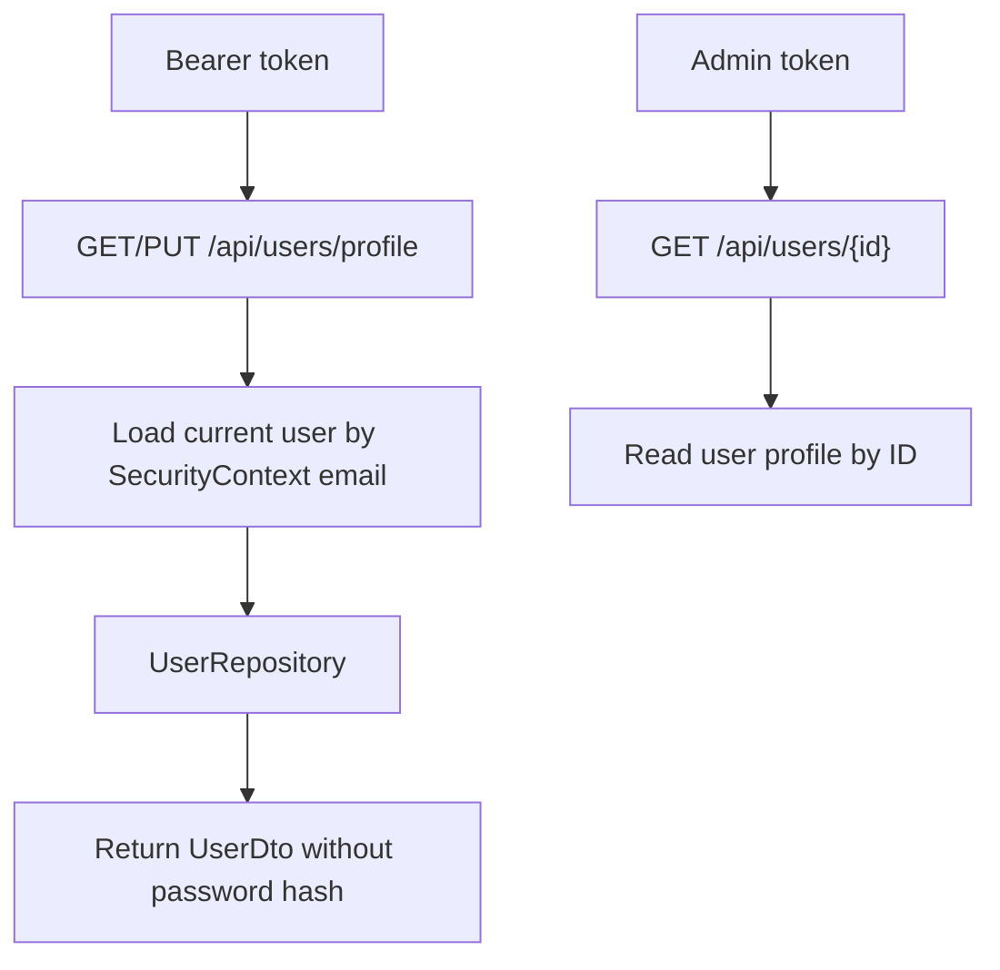
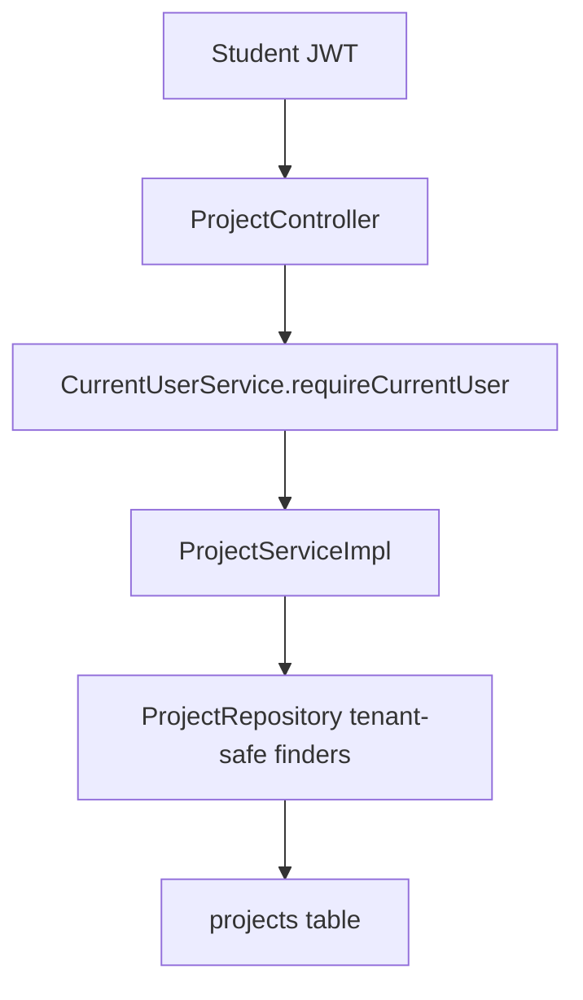
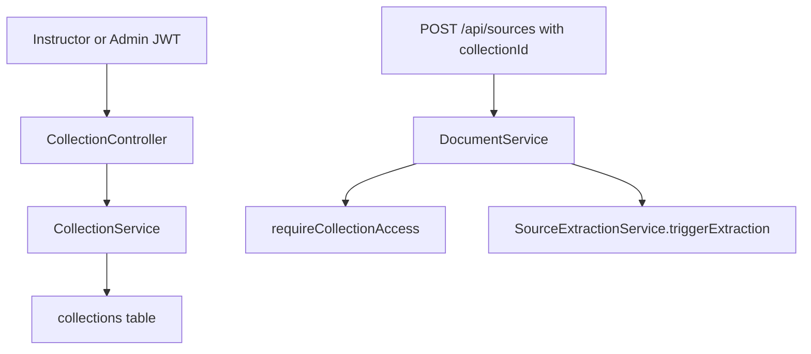
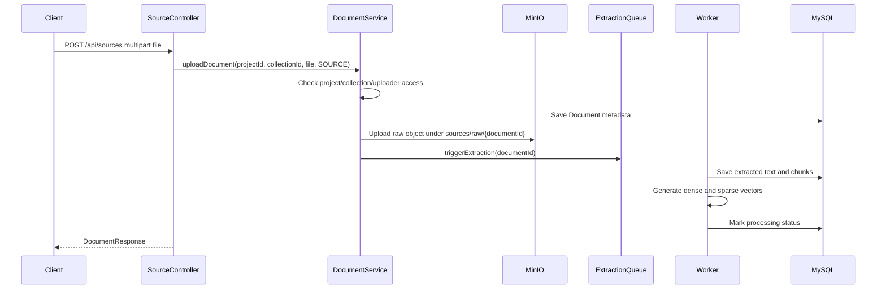
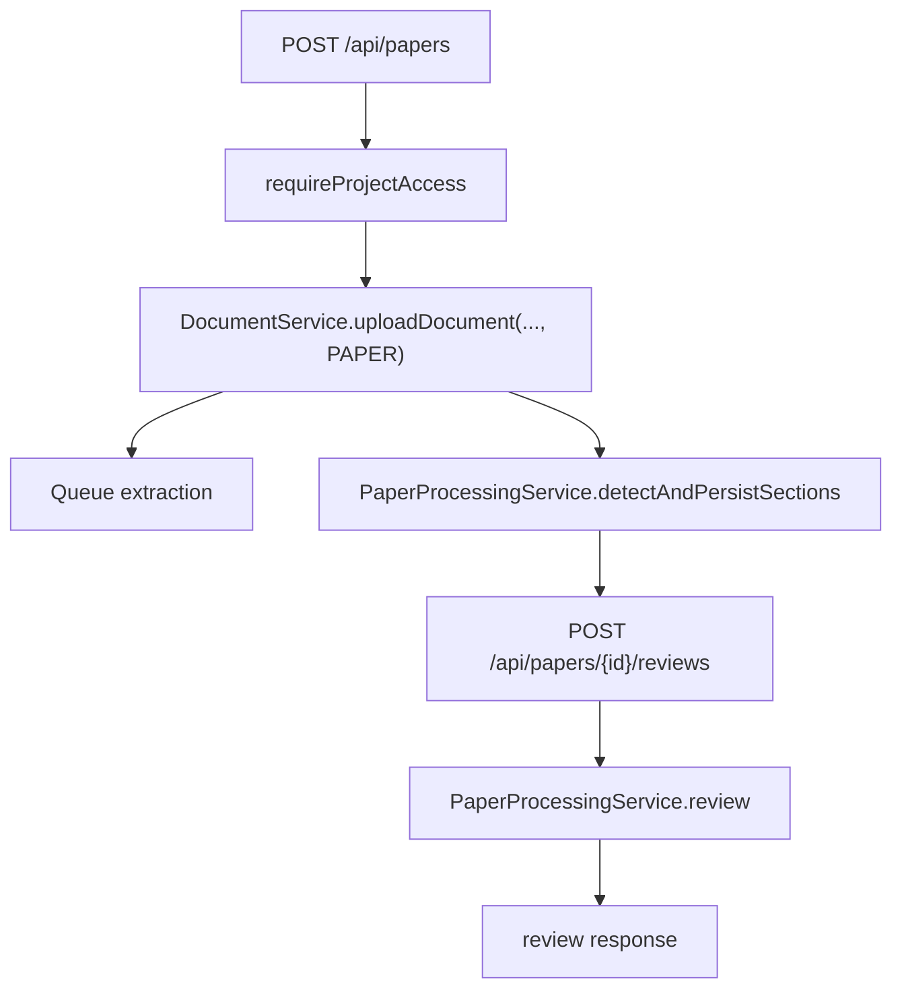
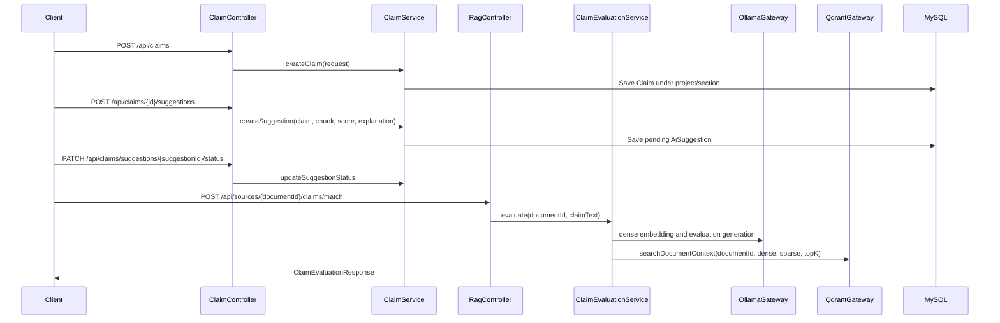
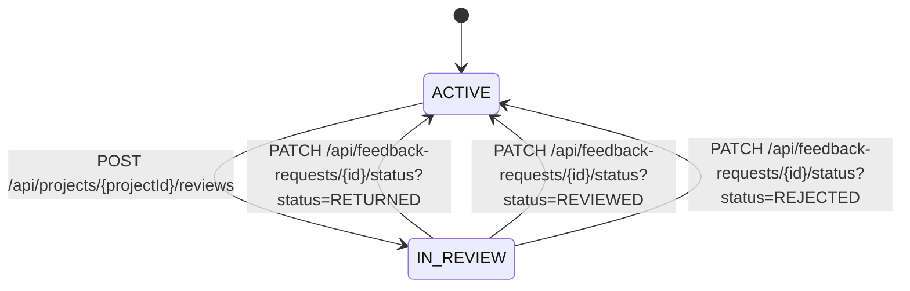
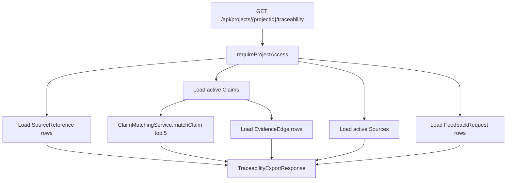

# EvidencePilot BE API Flows and Routes

This document maps the current Spring Boot backend API surface to the feature flows implemented in code.

Scope and assumptions:

- Base URL is whatever hosts this service, usually `http://localhost:8080`.
- All application API routes are under `/api` except Swagger/OpenAPI routes.
- Public routes are `POST /api/auth/register`, `POST /api/auth/login`, `GET /api/auth/verify-email`, `GET /api/health`, `/v3/api-docs/**`, `/swagger-ui/**`, and `/ws/**`.
- All other routes require `Authorization: Bearer <jwt>`.
- Role and ownership checks are split between `SecurityConfig`, `@PreAuthorize`, and `CurrentUserService`.
- MySQL is the relational source of truth. Qdrant is the vector search index for extracted source chunks.
- External AI calls go through `AiModelClient` to the single configured `AI_MODEL_BASE_URL`.

## High-Level Backend Flow

## Security and Access Model

Global web security:

| Route pattern | Access |
| --- | --- |
| `OPTIONS /**` | Public |
| `/api/auth/login` | Public |
| `/api/auth/register` | Public |
| `/api/auth/verify-email` | Public |
| `/api/health` | Public |
| `/error` | Public |
| `/v3/api-docs/**`, `/swagger-ui/**`, `/swagger-ui.html` | Public |
| `/ws`, `/ws/**` | Public |
| `/api/auth/update-password` | Authenticated |
| `/api/users/profile` | Authenticated |
| `/api/users/**` | `ADMIN` |
| Everything else | Authenticated |

JWT flow:

1. Login returns a JWT containing email and role.
2. `JwtAuthenticationFilter` reads `Authorization: Bearer <token>`.
3. If valid, it puts the email principal and `ROLE_<role>` authority into Spring Security.
4. Controllers and services load the real `User` from MySQL by email when they need ownership checks.

Ownership rules used by `CurrentUserService`:

| Resource | Access rule |
| --- | --- |
| User profile | Current authenticated user can access `/api/users/profile`; admin can manage `/api/users/**`. |
| Project | Admin can access any. Student can access owned projects. Instructor can read projects in `IN_REVIEW` when assigned by a feedback request. |
| Project writes | Admin can write. Student owner can write unless the project is `IN_REVIEW`. Instructor cannot write student project content. |
| Collection | Access follows collection ownership rules. |
| Source/document | Access follows project, collection, or uploader ownership. |
| Claim | Access follows the claim's project. |
| Paper | Access follows the paper's project. |
| Feedback request | Admin can access any. Instructor can act on assigned requests. Student can see own requests in list flow. |

## Route Summary

### Authentication

| Method | Route | Body / params | Main result |
| --- | --- | --- | --- |
| `POST` | `/api/auth/register` | JSON registration payload | Creates a student account and sends an email verification link. |
| `GET` | `/api/auth/verify-email` | Query `token` | Activates a newly registered account. |
| `POST` | `/api/auth/login` | JSON: `email`, `password` | Returns JWT, email, and role. |

### Users

| Method | Route | Body / params | Main result |
| --- | --- | --- | --- |
| `GET` | `/api/users/{id}` | Admin token | Returns one user. |
| `GET` | `/api/users/profile` | Bearer token | Returns current user's profile. |
| `PUT` | `/api/users/profile` | JSON profile fields | Updates current user's first/last name fields. |

### Projects

| Method | Route | Body / params | Main result |
| --- | --- | --- | --- |
| `GET` | `/api/projects` | Query `page`, `size`, `sort`, `q`, `status`, `active` | Lists projects accessible to the current user. |
| `GET` | `/api/projects/{id}` | Bearer token | Returns one accessible project. |
| `POST` | `/api/projects` | JSON project payload | Creates a project and assigns the current user as owner. |
| `PUT` | `/api/projects/{id}` | JSON project payload | Updates project metadata after write access checks. |
| `DELETE` | `/api/projects/{id}` | Bearer token | Soft-deletes a project. |
| `GET` | `/api/projects/{id}/members` | Bearer token | Lists project members. |
| `POST` | `/api/projects/{id}/members` | Query `userId`, `role` | Adds a project member. |
| `DELETE` | `/api/projects/{id}/members/{userId}` | Bearer token | Removes a project member. |
| `GET` | `/api/projects/{projectId}/documents` | Query paging/filter params | Lists project documents. |
| `GET` | `/api/projects/{projectId}/sources` | Query paging/filter params | Lists project source documents. |
| `GET` | `/api/projects/{projectId}/claims` | Query `page`, `size`, `sort`, `q`, `active` | Lists project claims. |
| `GET` | `/api/projects/{projectId}/collections` | Query `page`, `size`, `sort`, `q`, `active` | Lists project collections. |
| `GET` | `/api/projects/{projectId}/papers` | Bearer token | Lists active paper documents in a project. |
| `GET` | `/api/projects/{projectId}/traceability` | Bearer token | Builds traceability payload with claims, sources, matches, feedback, and graph evidence. |

### Documents and Sources

| Method | Route | Body / params | Main result |
| --- | --- | --- | --- |
| `GET` | `/api/documents/{id}` | Bearer token | Returns document metadata after access checks. |
| `POST` | `/api/documents` | Multipart `file`, optional `projectId` | Stores a source document and queues extraction. |
| `GET` | `/api/documents/{id}/chunks` | Bearer token | Lists extracted chunks for a document. |
| `GET` | `/api/documents/{id}/text` | Bearer token | Returns extracted document text. |
| `DELETE` | `/api/documents/{id}` | Bearer token | Soft-deletes a document. |
| `GET` | `/api/sources/{id}` | Bearer token | Returns active source metadata. |
| `GET` | `/api/sources/{id}/chunks` | Bearer token | Lists extracted chunks for a source. |
| `GET` | `/api/sources/{id}/text` | Bearer token | Returns extracted source text. |
| `POST` | `/api/sources` | Multipart `file`, optional `projectId`, optional `collectionId` | Stores a source and queues extraction. |
| `DELETE` | `/api/sources/{id}` | Bearer token | Soft-deletes source after write/access check. |

### Collections

| Method | Route | Body / params | Main result |
| --- | --- | --- | --- |
| `POST` | `/api/collections` | JSON collection payload | Creates an instructor-owned evidence collection. |
| `GET` | `/api/collections/{id}` | Bearer token | Returns one collection. |
| `DELETE` | `/api/collections/{id}` | Bearer token | Soft-deletes a collection. |

### Papers

| Method | Route | Body / params | Main result |
| --- | --- | --- | --- |
| `GET` | `/api/papers` | Bearer token | Admin gets all active papers; non-admin gets papers from own projects. |
| `GET` | `/api/papers/{id}` | Bearer token | Returns one active paper after project access check. |
| `GET` | `/api/papers/{id}/sections` | Bearer token | Lists detected paper sections. |
| `POST` | `/api/papers/{id}/reviews?targetStyle=...` | Optional target style | Runs AI paper review. |
| `DELETE` | `/api/papers/{id}` | Bearer token | Soft-deletes paper. |
| `POST` | `/api/papers` | Multipart `file`, `projectId` | Stores paper, queues extraction, and detects sections. |

### Claims

| Method | Route | Body / params | Main result |
| --- | --- | --- | --- |
| `GET` | `/api/claims` | Query `page`, `size`, `sort`, `q`, `active` | Lists claims visible to the current user. |
| `GET` | `/api/claims/{id}` | Bearer token | Returns one claim after project access check. |
| `POST` | `/api/claims` | JSON claim creation payload | Creates a claim under an accessible project section. |
| `PUT` | `/api/claims/{id}` | JSON: `content`, `aiConfidenceScore` | Updates claim content/confidence. |
| `DELETE` | `/api/claims/{id}` | Bearer token | Soft-deletes claim. |
| `GET` | `/api/claims/{id}/suggestions` | Bearer token | Lists AI-generated evidence suggestions. |
| `POST` | `/api/claims/{id}/suggestions` | Query `documentChunkId`, `score`, `explanation` | Creates a pending AI suggestion. |
| `PATCH` | `/api/claims/suggestions/{suggestionId}/status` | Query `status` | Accepts or rejects a suggestion. |
| `GET` | `/api/claims/{id}/mappings` | Bearer token | Lists claim-evidence mappings. |
| `GET` | `/api/claims/{id}/edges` | Bearer token | Lists AI verdict graph edges. |

### Claim Evaluation

| Method | Route | Body / params | Main result |
| --- | --- | --- | --- |
| `POST` | `/api/paper/{documentId}/claims/match` | JSON: `claimText` | Evaluates a claim against a paper document. |
| `POST` | `/api/sources/{documentId}/claims/match` | JSON: `claimText` | Evaluates a claim against a source document. |

### Feedback

| Method | Route | Body / params | Main result |
| --- | --- | --- | --- |
| `GET` | `/api/feedback-requests` | Bearer token | Admin gets all; instructor gets assigned; student gets own requests. |
| `POST` | `/api/projects/{projectId}/reviews` | JSON: `instructorId` | Creates feedback request and sets project `IN_REVIEW`. |
| `POST` | `/api/feedback-requests/{id}/feedback` | JSON feedback payload | Creates or replaces instructor feedback for the request. |
| `PATCH` | `/api/feedback-requests/{id}/status` | Query `status` | Sets request to `RETURNED`, `REVIEWED`, or `REJECTED`, and project to `ACTIVE`. |

### Notifications and Health

| Method | Route | Body / params | Main result |
| --- | --- | --- | --- |
| `GET` | `/api/notifications` | Bearer token | Lists current user's notifications. |
| `GET` | `/api/notifications/unread-count` | Bearer token | Returns current user's unread notification count. |
| `PATCH` | `/api/notifications/{id}/read` | Bearer token | Marks one current-user notification as read. |
| `GET` | `/api/health` | Public | Returns backend and AI worker health. |

## Feature Flow Details

## 1. Authentication Flow

Explanation:

- Register is public and creates a `users` row.
- Duplicate email returns `409 Conflict`.
- Login returns `401 Unauthorized` for missing user or wrong password to avoid user enumeration.
- JWT expiration is configured by `JWT_EXPIRATION_MS`, default 24 hours.
- Password update requires an authenticated user, verifies `oldPassword`, then stores only the new BCrypt hash.

## 2. User Profile and Admin User Management Flow

Explanation:

- `/api/users/profile` is self-service and only exposes `UserResponse`.
- `PUT /api/users/profile` accepts profile update fields; role, email, and password are not changed here.
- `/api/users/**` is globally restricted to `ADMIN` in `SecurityConfig`.
- The current controller only exposes `GET /api/users/{id}` plus the profile self-service routes.

## 3. Student Project Flow

Explanation:

- Project CRUD is student-owned.
- Create ignores client-supplied student/status/active fields; owner is read from JWT context.
- Reads use active, student-scoped repository methods.
- Delete is soft-delete: `active=false`, `status=DELETED`.
- Project source routes use `SourceQueryServiceImpl` and `CurrentUserService` to allow admins, owning students, and assigned instructors during review.

## 4. Collection Flow

Explanation:

- `DatasetController` is not present in the current backend.
- Instructor evidence libraries are represented by `CollectionController` and collection-scoped source documents.
- Source upload accepts optional `collectionId`; access is checked with `CurrentUserService.requireCollectionAccess`.

## 5. Source Upload, Extraction, Chunking, Embedding, and Indexing Flow

Explanation:

- `SourceController` can attach a source to a project, a collection, or only the uploader.
- `DocumentController` also exposes `POST /api/documents`, which uploads a source document with optional `projectId`.
- Raw files are stored in MinIO bucket `evidence-pilot-bucket`; MySQL remains the metadata and text source of truth.
- Extraction is asynchronous through `SourceExtractionService.triggerExtraction`.

## 6. Paper Upload and Paper Review Flow

Explanation:

- Paper upload is project-scoped and requires project access.
- Paper upload uses the shared `DocumentService` path with `DocumentType.PAPER`.
- `PaperProcessingService.detectAndPersistSections` runs after upload.
- Review is exposed as `POST /api/papers/{id}/reviews` and accepts optional `targetStyle`.

## 7. Claim CRUD, Suggestions, and Evaluation Flow

Explanation:

- Claim CRUD is project-scoped through `ClaimService`.
- AI suggestion routes are under `/api/claims/{id}/suggestions` and `/api/claims/suggestions/{suggestionId}/status`.
- Evidence lookup routes are `/api/claims/{id}/mappings` and `/api/claims/{id}/edges`.
- Claim evaluation is document-scoped through `RagController` at `/api/paper/{documentId}/claims/match` and `/api/sources/{documentId}/claims/match`.
- `ClaimEvaluationServiceImpl` gets dense embeddings from `OllamaGateway`, sparse vectors from `SparseVectorGenerator`, searches document context through `QdrantGateway`, then asks Ollama to generate the evaluation.

## 8. Feedback Review Flow

Explanation:

- A student submits a project for review with an instructor ID.
- Backend verifies:
  - The project exists.
  - Caller has project write access.
  - Assigned user exists and has `INSTRUCTOR` role.
- Backend creates a `feedback_requests` row with status `PENDING`.
- Backend sets the project status to `IN_REVIEW`.
- Instructor feedback is one-to-one with a feedback request because `instructor_feedbacks.request_id` is unique.
- `PATCH /api/feedback-requests/{id}/status` sets feedback status to `RETURNED`, `REVIEWED`, or `REJECTED`, and sets the project back to `ACTIVE`.

## 9. Traceability Export Flow

Explanation:

- Export is project-scoped and requires project access.
- It assembles a single response containing:
  - Project ID, title, status, and export timestamp.
  - Active claims.
  - Top 5 matches per claim from current Qdrant/MySQL matching.
  - Existing `EvidenceEdge` graph data when analysis has been run.
  - Active sources with reference counts.
  - Feedback request IDs, instructor IDs, and statuses.
- Missing bibliography/export values are represented as `"MISSING"`.
- Export recomputes claim matches at request time, so results can change if Qdrant contents or source chunks change.

## Error Response Shape

`GlobalExceptionHandler` normalizes many failures into `ApiErrorResponse`.

Common mappings:

| Failure | HTTP status |
| --- | --- |
| Bean validation failure | `400 Bad Request` with field errors |
| Missing request parameter | `400 Bad Request` |
| `ResourceNotFoundException` | `404 Not Found` |
| `ResponseStatusException` | Status from exception |
| `AiValidationException` | `502 Bad Gateway` |
| Database integrity conflict | `409 Conflict` |
| Multipart upload failure | `400 Bad Request` |

## External Systems and Configuration

| System | Config | Used by | Purpose |
| --- | --- | --- | --- |
| MySQL | `DB_HOST`, `DB_PORT`, `DB_NAME`, `DB_USERNAME`, `DB_PASSWORD` | JPA repositories | Relational source of truth. |
| MinIO | `minio.url`, `minio.access-key`, `minio.secret-key`, `minio.bucket-name` | `DocumentServiceImpl`, `DocumentObjectStorage` | Raw document object storage. |
| RabbitMQ | `RabbitMQConfig` | `SourceExtractionServiceImpl`, `DocumentExtractionListener` | Async document extraction queue. |
| Ollama / AI worker | `ollama.url`, `AI_MODEL_BASE_URL`, model settings | `OllamaGateway`, `AiModelClient` | Extraction, embeddings, and generation. |
| Qdrant | Qdrant client/gateway configuration | `QdrantService`, `QdrantGateway` | Vector index for source chunks and document-context search. |
| JWT | `JWT_SECRET`, `JWT_EXPIRATION_MS` | `JwtUtil`, security filter | Stateless auth. |

## Feature-to-Code Map

| Feature | Controller | Main services | Main persistence |
| --- | --- | --- | --- |
| Authentication | `AuthController` | `AuthService`, `JwtUtil`, `PasswordEncoder` | `users` |
| User profile/admin | `UserController` | `UserService`, `CurrentUserService` | `users` |
| Projects | `ProjectController` | `ProjectServiceImpl`, `DocumentServiceImpl`, `ClaimServiceImpl`, `CollectionServiceImpl` | `projects`, `project_members`, `documents`, `claims`, `collections` |
| Documents and sources | `DocumentController`, `SourceController` | `DocumentServiceImpl`, `SourceExtractionServiceImpl`, `DocumentExtractionWorkerImpl` | `documents`, `document_texts`, `document_chunks` |
| Collections | `CollectionController` | `CollectionServiceImpl`, `CurrentUserService` | `collections` |
| Papers | `PaperController` | `DocumentServiceImpl`, `PaperProcessingService` | `documents`, `paper_sections` |
| Claims | `ClaimController`, `RagController` | `ClaimServiceImpl`, `ClaimEvaluationServiceImpl`, `OllamaGateway`, `QdrantGateway` | `claims`, `ai_suggestions`, `claim_evidence_mappings`, `evidence_edges`, `document_chunks` |
| Feedback | `FeedbackController` | `FeedbackService`, `CurrentUserService` | `feedback_requests`, `instructor_feedbacks`, `projects` |
| Notifications | `SystemNotificationController` | `SystemNotificationService` | `system_notifications` |
| Traceability export | `TraceabilityExportController` | `TraceabilityExportService`, `CurrentUserService` | `claims`, `documents`, `feedback_requests`, `evidence_edges` |
