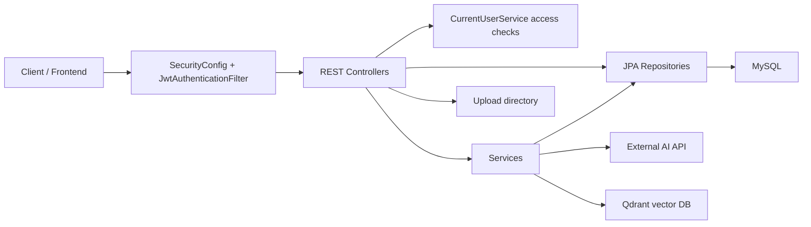
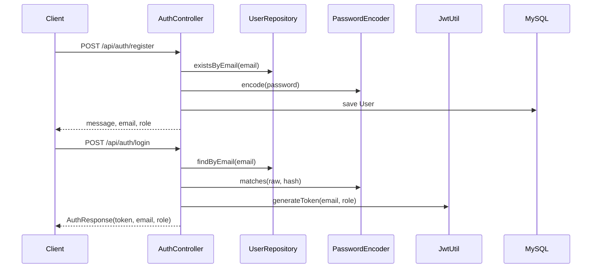
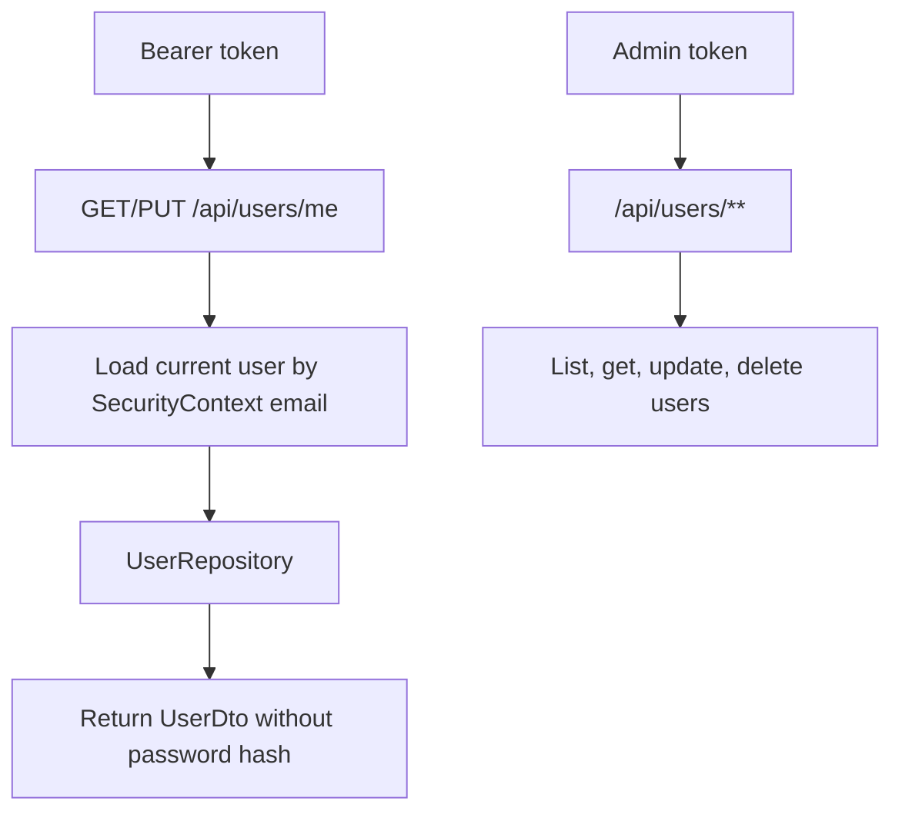
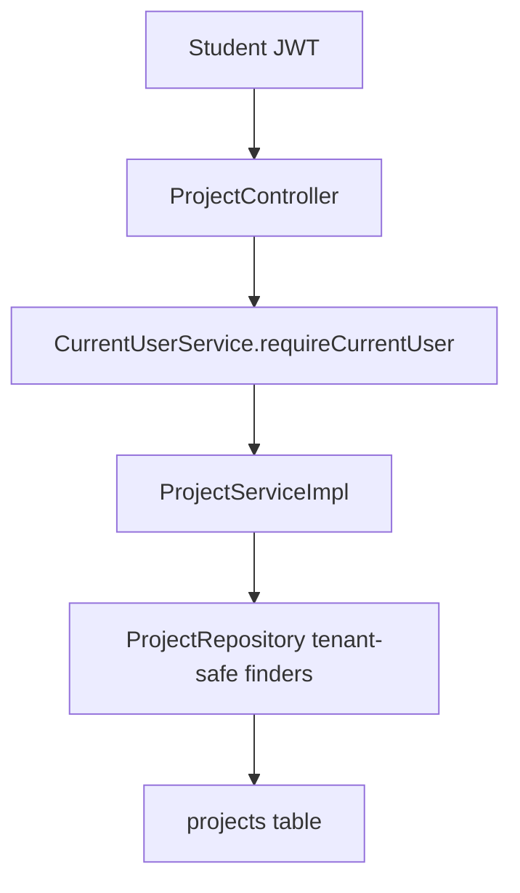
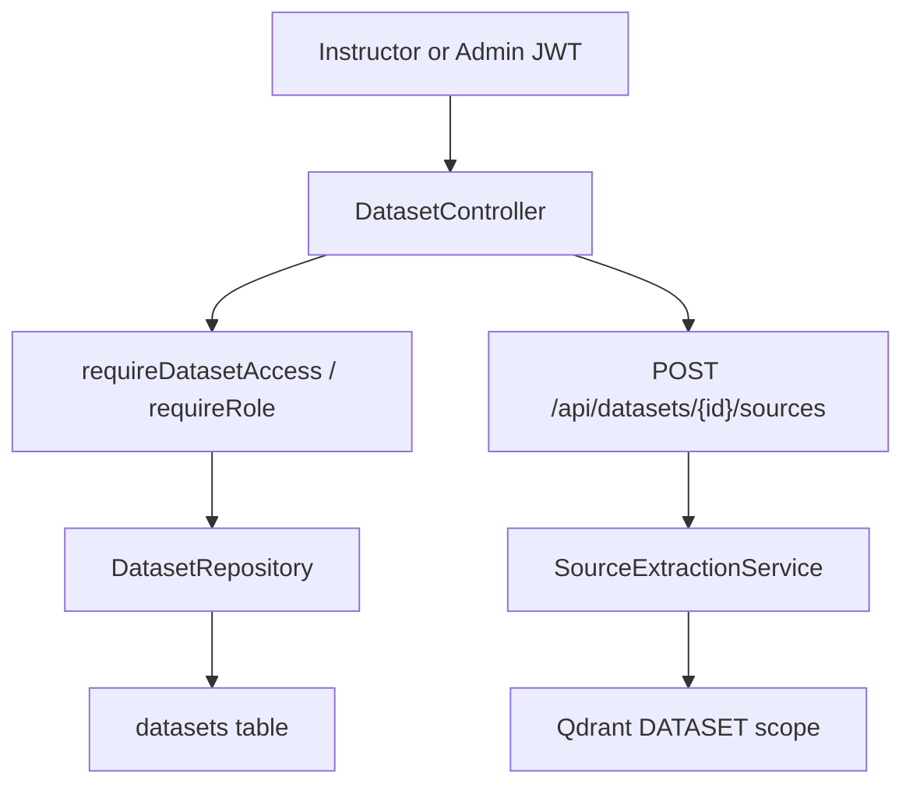
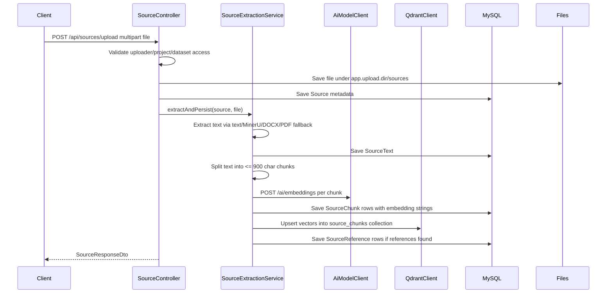
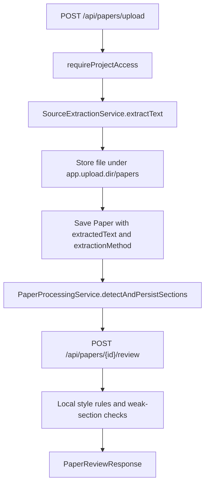
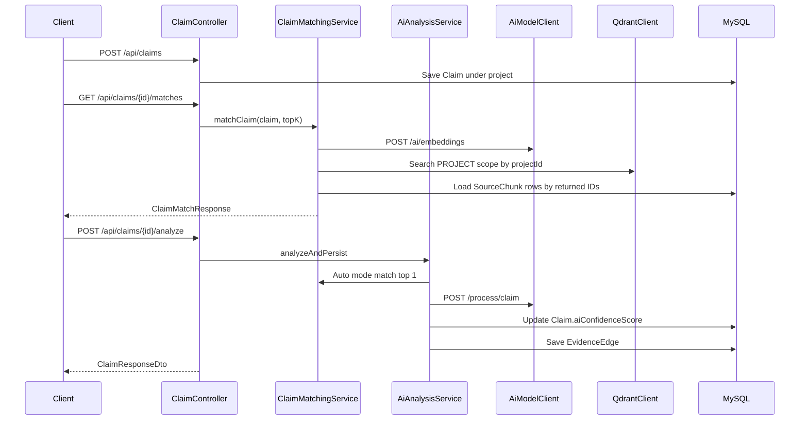
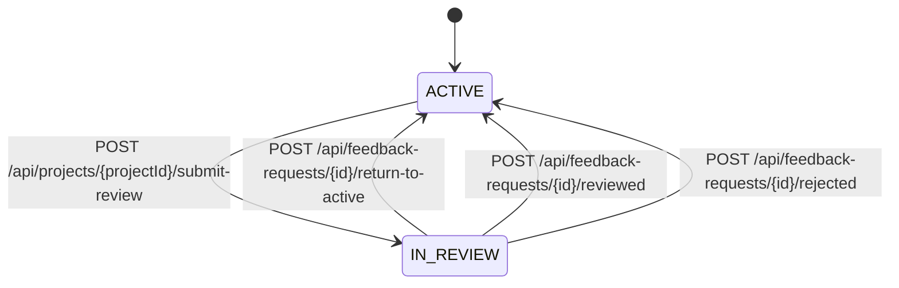
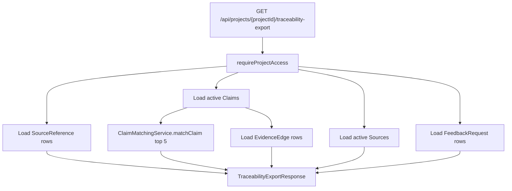

[API-Flows-And-Routes.md](https://github.com/user-attachments/files/29200525/API-Flows-And-Routes.md)
# EvidencePilot BE API Flows and Routes

This document maps the current Spring Boot backend API surface to the feature flows implemented in code.

Scope and assumptions:

- Base URL is whatever hosts this service, usually `http://localhost:8080`.
- All application API routes are under `/api` except Swagger/OpenAPI routes.
- Public routes are `POST /api/auth/register`, `POST /api/auth/login`, `/v3/api-docs/**`, and `/swagger-ui/**`.
- All other routes require `Authorization: Bearer <jwt>`.
- Role and ownership checks are split between `SecurityConfig`, `@PreAuthorize`, and `CurrentUserService`.
- MySQL is the relational source of truth. Qdrant is the vector search index for extracted source chunks.
- External AI calls go through `AiModelClient` to the configured AI API base URLs.

## High-Level Backend Flow

## Security and Access Model

Global web security:

| Route pattern | Access |
| --- | --- |
| `OPTIONS /**` | Public |
| `/api/auth/login` | Public |
| `/api/auth/register` | Public |
| `/error` | Public |
| `/v3/api-docs/**`, `/swagger-ui/**`, `/swagger-ui.html` | Public |
| `/api/auth/update-password` | Authenticated |
| `/api/users/me` | Authenticated |
| `/api/users/**` | `ADMIN` |
| Everything else | Authenticated |

JWT flow:

1. Login returns a JWT containing email and role.
2. `JwtAuthenticationFilter` reads `Authorization: Bearer <token>`.
3. If valid, it puts the email principal and `ROLE_<role>` authority into Spring Security.
4. Controllers and services load the real `User` from MySQL by email when they need ownership checks.

Ownership rules used by `CurrentUserService`:

| Resource | Access rule |
| --- | --- |
| User profile | Current authenticated user can access `/api/users/me`; admin can manage `/api/users/**`. |
| Project | Admin can access any. Student can access owned projects. Instructor can read projects in `IN_REVIEW` when assigned by a feedback request. |
| Project writes | Admin can write. Student owner can write unless the project is `IN_REVIEW`. Instructor cannot write student project content. |
| Dataset | Admin can access any. Instructor can access owned datasets. |
| Source | Access follows project, dataset, or uploader ownership. |
| Claim | Access follows the claim's project. |
| Paper | Access follows the paper's project. |
| Feedback request | Admin can access any. Instructor can act on assigned requests. Student can see own requests in list flow. |

## Route Summary

### Authentication

| Method | Route | Body / params | Main result |
| --- | --- | --- | --- |
| `POST` | `/api/auth/register` | JSON: `email`, `password`, `role` | Creates user with BCrypt password hash. |
| `POST` | `/api/auth/login` | JSON: `email`, `password` | Returns JWT, email, and role. |
| `POST` | `/api/auth/update-password` | JSON: `oldPassword`, `newPassword` | Verifies old password and stores new BCrypt hash. |

### Users

| Method | Route | Body / params | Main result |
| --- | --- | --- | --- |
| `GET` | `/api/users/me` | Bearer token | Returns current user's profile. |
| `PUT` | `/api/users/me` | JSON: `firstName`, `lastName`, `age` | Updates current user's non-sensitive profile fields. |
| `GET` | `/api/users` | Admin token | Lists all users. |
| `GET` | `/api/users/{id}` | Admin token | Returns one user. |
| `PUT` | `/api/users/{id}` | Admin token, `User` JSON | Replaces user fields; hashes password if changed. |
| `DELETE` | `/api/users/{id}` | Admin token | Deletes user. |

### Projects

| Method | Route | Body / params | Main result |
| --- | --- | --- | --- |
| `GET` | `/api/projects` | Student token | Lists active projects owned by the student. |
| `GET` | `/api/projects/{id}` | Student token | Returns one active owned project. |
| `POST` | `/api/projects` | JSON: `title`, `description` | Creates project for authenticated student. |
| `PUT` | `/api/projects/{id}` | JSON: `title`, `description` | Updates owned active project. |
| `DELETE` | `/api/projects/{id}` | Student token | Soft-deletes project and sets status `DELETED`. |
| `GET` | `/api/projects/{projectId}/sources` | Bearer token | Lists active sources for a project after project access checks. |
| `GET` | `/api/projects/{projectId}/sources/{sourceId}` | Bearer token | Returns one active source inside a project. |
| `GET` | `/api/projects/{projectId}/traceability-export` | Bearer token | Builds export payload with claims, sources, matches, feedback, and graph evidence. |

### Datasets

| Method | Route | Body / params | Main result |
| --- | --- | --- | --- |
| `GET` | `/api/datasets` | Bearer token | Admin gets all active datasets; instructor gets owned datasets; student gets empty list. |
| `GET` | `/api/datasets/{id}` | Bearer token | Returns one active dataset after access check. |
| `GET` | `/api/datasets/by-instructor/{instructorId}` | Bearer token | Lists active datasets for an instructor when caller is that instructor or admin. |
| `POST` | `/api/datasets` | `Dataset` JSON | Creates dataset for current instructor; admin may assign owner in payload. |
| `PUT` | `/api/datasets/{id}` | `Dataset` JSON | Updates active dataset; non-admin cannot transfer ownership. |
| `DELETE` | `/api/datasets/{id}` | Bearer token | Soft-deletes dataset. |
| `POST` | `/api/datasets/{id}/sources` | Multipart `file` | Stores source, extracts text, chunks, embeds, and indexes under `DATASET` scope. |
| `GET` | `/api/datasets/{id}/sources` | Bearer token | Lists active sources in dataset. |
| `GET` | `/api/datasets/{id}/chunks` | Bearer token | Lists extracted chunks for all dataset sources. |
| `GET` | `/api/datasets/{id}/similar?query=...&topK=5` | Query text | Embeds query, searches Qdrant inside dataset scope, returns matching chunks. |
| `GET` | `/api/datasets/{id}/graph` | Bearer token | Returns graph nodes for sources/chunks and `contains` edges. |

### Sources

| Method | Route | Body / params | Main result |
| --- | --- | --- | --- |
| `GET` | `/api/sources/{id}` | Bearer token | Returns active source metadata after source access check. |
| `GET` | `/api/sources/by-dataset/{datasetId}` | Bearer token | Lists active sources for a dataset. |
| `GET` | `/api/sources/{id}/chunks` | Bearer token | Lists extracted chunks for a source. |
| `DELETE` | `/api/sources/{id}` | Bearer token | Soft-deletes source after write/access check. |
| `POST` | `/api/sources/upload` | Multipart `file`, `uploadedBy`, optional `projectId`, optional `datasetId` | Stores source, persists metadata, extracts/chunks/embeds/indexes content. |

### Papers

| Method | Route | Body / params | Main result |
| --- | --- | --- | --- |
| `GET` | `/api/papers` | Bearer token | Admin gets all active papers; non-admin gets papers from own projects. |
| `GET` | `/api/papers/{id}` | Bearer token | Returns one active paper after project write access check. |
| `GET` | `/api/papers/by-project/{projectId}` | Bearer token | Lists active papers in one project. |
| `GET` | `/api/papers/{id}/sections` | Bearer token | Lists detected paper sections. |
| `POST` | `/api/papers/{id}/review?targetStyle=...` | Optional target style | Runs local structural paper review. |
| `DELETE` | `/api/papers/{id}` | Bearer token | Soft-deletes paper. |
| `POST` | `/api/papers/upload` | Multipart `file`, `projectId` | Extracts paper text, stores file, persists paper, detects sections. |

### Claims

| Method | Route | Body / params | Main result |
| --- | --- | --- | --- |
| `GET` | `/api/claims` | Bearer token | Admin gets all active claims; non-admin gets claims from own projects. |
| `GET` | `/api/claims/{id}` | Bearer token | Returns one active claim after project access check. |
| `GET` | `/api/claims/by-project/{projectId}` | Bearer token | Lists active claims in one project. |
| `POST` | `/api/claims` | `Claim` JSON with `project.id` and `content` | Creates claim under an accessible project. |
| `PUT` | `/api/claims/{id}` | `Claim` JSON | Updates claim while preserving original project. |
| `DELETE` | `/api/claims/{id}` | Bearer token | Soft-deletes claim. |
| `GET` | `/api/claims/{id}/matches?topK=5` | Optional `topK` | Embeds claim, searches Qdrant by project, returns ranked source chunks. |
| `POST` | `/api/claims/{id}/analyze` | Optional `sourceId`, `excerpt`, `title` | Runs claim analysis and persists confidence plus `EvidenceEdge`. |

### Feedback

| Method | Route | Body / params | Main result |
| --- | --- | --- | --- |
| `GET` | `/api/feedback-requests` | Bearer token | Admin gets all; instructor gets assigned; student gets own requests. |
| `POST` | `/api/projects/{projectId}/submit-review` | JSON: `instructorId` | Creates feedback request and sets project `IN_REVIEW`. |
| `POST` | `/api/feedback-requests/{id}/feedback` | JSON: `content` | Creates or replaces instructor feedback for the request. |
| `POST` | `/api/feedback-requests/{id}/return-to-active` | Bearer token | Sets request `RETURNED` and project `ACTIVE`. |
| `POST` | `/api/feedback-requests/{id}/reviewed` | Bearer token | Sets request `REVIEWED` and project `ACTIVE`. |
| `POST` | `/api/feedback-requests/{id}/rejected` | Bearer token | Sets request `REJECTED` and project `ACTIVE`. |

## Feature Flow Details

## 1. Authentication Flow

Explanation:

- Register is public and creates a `users` row.
- Duplicate email returns `409 Conflict`.
- Login returns `401 Unauthorized` for missing user or wrong password to avoid user enumeration.
- JWT expiration is configured by `JWT_EXPIRATION_MS`, default 24 hours.
- Password update requires an authenticated user, verifies `oldPassword`, then stores only the new BCrypt hash.

## 2. User Profile and Admin User Management Flow

Explanation:

- `/api/users/me` is self-service and only exposes `UserDto`.
- `PUT /api/users/me` accepts only profile fields: `firstName`, `lastName`, `age`.
- `/api/users/**` is globally restricted to `ADMIN` in `SecurityConfig`.
- Admin update accepts a `User` entity payload. If the incoming password value differs from the existing hash, it is BCrypt-hashed before save.

## 3. Student Project Flow

Explanation:

- Project CRUD is student-owned.
- Create ignores client-supplied student/status/active fields; owner is read from JWT context.
- Reads use active, student-scoped repository methods.
- Delete is soft-delete: `active=false`, `status=DELETED`.
- Project source routes use `SourceQueryServiceImpl` and `CurrentUserService` to allow admins, owning students, and assigned instructors during review.

## 4. Dataset Flow

Explanation:

- Datasets are instructor-owned reference collections.
- Admin can access all active datasets.
- Instructor can access only owned datasets.
- Students are authenticated but get an empty dataset list from `GET /api/datasets`.
- Dataset upload creates a `Source` linked to `dataset_id`, extracts text, chunks it, generates embeddings, and indexes vectors with Qdrant payload `scope_type=DATASET` and `scope_id=<datasetId>`.
- Dataset similarity search embeds the query and searches only that dataset scope.
- Dataset graph builds source and chunk nodes directly from MySQL; it does not call AI.

## 5. Source Upload, Extraction, Chunking, Embedding, and Indexing Flow

Explanation:

- `SourceController` can attach a source to a project, a dataset, or both if both IDs are supplied.
- `DatasetController` also has a dataset-specific source upload route that always links to a dataset.
- Files are stored under `app.upload.dir`, default `/app/uploads`.
- Text extraction behavior:
  - Plain text, Markdown, and `text/*` content types are read as UTF-8.
  - If `MINERU_COMMAND` is configured, MinerU is attempted first.
  - DOCX fallback reads `word/document.xml`.
  - PDF fallback uses a simple text-fragment extraction from PDF bytes.
- MySQL remains the source of truth. Qdrant sync failures are logged and do not roll back MySQL persistence.
- References are parsed from headings like `References`, `Bibliography`, or `Works Cited`.

## 6. Paper Upload and Paper Review Flow

Explanation:

- Paper upload is project-scoped and requires project access.
- The paper file is stored separately from source files under `papers`.
- Extracted text is stored on the `papers` row, not in `source_texts`.
- `PaperProcessingService` detects sections from headings and persists `paper_sections`.
- Review is currently local/rule-based:
  - Detects likely paper style from sections.
  - Accepts optional `targetStyle`.
  - Reports missing expected sections.
  - Reports weak sections with fewer than 18 words.
  - Adds claim-coverage recommendations for key sections.

## 7. Claim CRUD, Matching, and Analysis Flow

Explanation:

- Claim CRUD is project-scoped.
- Claim create requires a `project.id` in the JSON payload and stores the claim under that project.
- Matching:
  - Generates an embedding for the claim content.
  - Searches Qdrant with `scope_type=PROJECT` and `scope_id=<projectId>`.
  - Loads returned chunk IDs from MySQL.
  - Returns matches with source ID, filename, chunk ID, page, excerpt, score, suitability, and explanation.
- Suitability thresholds:
  - `strong`: score >= `0.75`
  - `medium`: score >= `0.50`
  - `weak`: score < `0.50`
- Analysis has two modes:
  - Auto mode: no params. It finds the top match first, then calls `/process/claim`.
  - Manual mode: requires both `sourceId` and `excerpt`; optional `title`. It skips the match phase.
- Analysis persists:
  - `claims.ai_confidence_score`
  - `evidence_edges` row with verdict, confidence, explanation, missing evidence, and linked source chunk.

## 8. Feedback Review Flow

Explanation:

- A student submits a project for review with an instructor ID.
- Backend verifies:
  - The project exists.
  - Caller has project write access.
  - Assigned user exists and has `INSTRUCTOR` role.
- Backend creates a `feedback_requests` row with status `PENDING`.
- Backend sets the project status to `IN_REVIEW`.
- Instructor feedback is one-to-one with a feedback request because `instructor_feedbacks.request_id` is unique.
- Transition endpoints set feedback status to `RETURNED`, `REVIEWED`, or `REJECTED`, and set the project back to `ACTIVE`.

## 9. Traceability Export Flow

Explanation:

- Export is project-scoped and requires project access.
- It assembles a single response containing:
  - Project ID, title, status, and export timestamp.
  - Active claims.
  - Top 5 matches per claim from current Qdrant/MySQL matching.
  - Existing `EvidenceEdge` graph data when analysis has been run.
  - Active sources with reference counts.
  - Feedback request IDs, instructor IDs, and statuses.
- Missing bibliography/export values are represented as `"MISSING"`.
- Export recomputes claim matches at request time, so results can change if Qdrant contents or source chunks change.

## Error Response Shape

`GlobalExceptionHandler` normalizes many failures into `ApiErrorResponse`.

Common mappings:

| Failure | HTTP status |
| --- | --- |
| Bean validation failure | `400 Bad Request` with field errors |
| Missing request parameter | `400 Bad Request` |
| `ResourceNotFoundException` | `404 Not Found` |
| `ResponseStatusException` | Status from exception |
| `AiValidationException` | `502 Bad Gateway` |
| Database integrity conflict | `409 Conflict` |
| Multipart upload failure | `400 Bad Request` |

## External Systems and Configuration

| System | Config | Used by | Purpose |
| --- | --- | --- | --- |
| MySQL | `DB_HOST`, `DB_PORT`, `DB_NAME`, `DB_USERNAME`, `DB_PASSWORD` | JPA repositories | Relational source of truth. |
| Upload directory | `APP_UPLOAD_DIR` | Source and paper upload controllers | Stores uploaded files. |
| MinerU | `MINERU_COMMAND`, `MINERU_METHOD`, `MINERU_BACKEND`, `MINERU_TIMEOUT_SECONDS` | `SourceExtractionService` | Optional richer document extraction. |
| AI API | `AI_MODEL_LOCAL_BASE_URL`, `AI_MODEL_NGROK_BASE_URL`, `AI_MODEL_BASE_URL`, `AI_MODEL_API_KEY` | `AiModelClient` | Embeddings and claim analysis calls. |
| Qdrant | `QDRANT_URL` | `QdrantClient` | Vector index for source chunks. |
| JWT | `JWT_SECRET`, `JWT_EXPIRATION_MS` | `JwtUtil`, security filter | Stateless auth. |

## Feature-to-Code Map

| Feature | Controller | Main services | Main persistence |
| --- | --- | --- | --- |
| Authentication | `AuthController` | `JwtUtil`, `PasswordEncoder` | `users` |
| User profile/admin | `UserController` | `PasswordEncoder` | `users` |
| Projects | `ProjectController` | `ProjectServiceImpl`, `SourceQueryServiceImpl`, `CurrentUserService` | `projects`, `sources` |
| Datasets | `DatasetController` | `CurrentUserService`, `SourceExtractionService`, `AiModelClient`, `QdrantClient` | `datasets`, `sources`, `source_chunks` |
| Sources | `SourceController` | `CurrentUserService`, `SourceExtractionService` | `sources`, `source_texts`, `source_chunks`, `source_references` |
| Papers | `PaperController` | `SourceExtractionService`, `PaperProcessingService` | `papers`, `paper_sections` |
| Claims | `ClaimController` | `ClaimMatchingService`, `AiAnalysisService`, `CurrentUserService` | `claims`, `evidence_edges`, `source_chunks` |
| Feedback | `FeedbackController` | `CurrentUserService` | `feedback_requests`, `instructor_feedbacks`, `projects` |
| Traceability export | `TraceabilityExportController` | `ClaimMatchingService`, `CurrentUserService` | `claims`, `sources`, `source_references`, `feedback_requests`, `evidence_edges` |

