# EvidencePilot System Architecture and Data Model

## System Overview

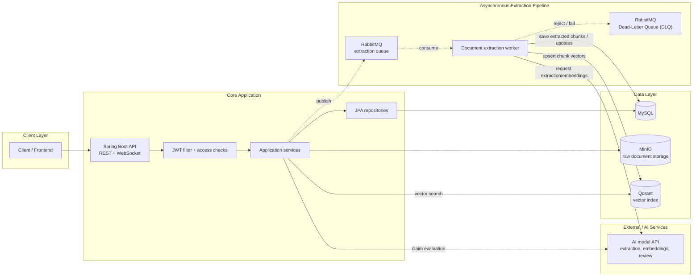

business data kept in MySQL, uploaded files in MinIO, and searchable vectors in Qdrant. RabbitMQ decouples document upload from extraction, chunking, and embedding work. The AI model API returns extracted content and embeddings to the backend worker; the backend then writes chunk vectors into Qdrant.

## Processing Flow

```mermaid
flowchart TD
    subgraph Document Ingestion Pipeline [Automated Background Process]
        Upload["Upload source document"] --> StoreFile["Store raw file (MinIO)"]
        StoreFile --> MarkUploaded["Save to DB: status = UPLOADED"]
        
        MarkUploaded --> PushQueue["Publish job to RabbitMQ"]
        
        PushQueue -->|Ack Success| SaveQueued["Update DB: status = QUEUED"]
        PushQueue -->|Failure or Timeout| FailState["Update DB: status = FAILED"]
        
        SaveQueued --> AIParsing["Worker: Send raw file to AI API for Markdown Extraction"]
        
        AIParsing -->|Returns Markdown| Chunks["Worker: Chunk Markdown & Persist (MySQL)"]
        AIParsing -->|Failure or Timeout| FailState
        
        Chunks --> GenEmbed["Worker: Send chunks to AI API for Embeddings"]
        
        GenEmbed -->|Returns Vectors| Vector["Worker: Upsert vectors (Qdrant)"]
        GenEmbed -->|Failure or Timeout| FailState
        
        Vector --> Ready["Update DB: status = READY"]
    end
```

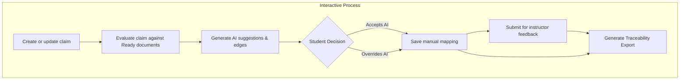

## Main Workflow Activity Diagrams

### 1.Authentication And Email Verification

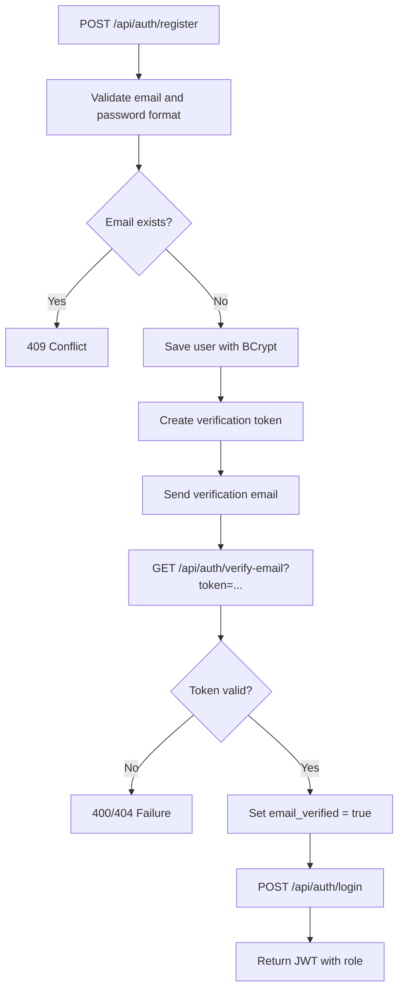

### 2.Workspace & Entity Lifecycle Workflow

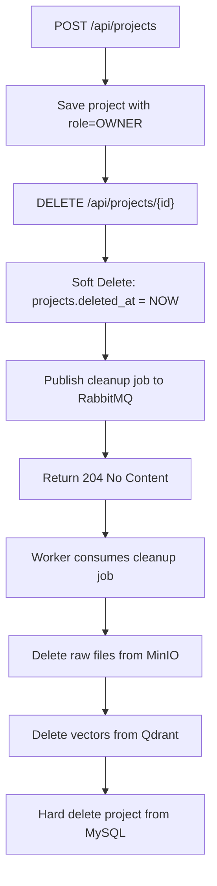

### 3.Source Ingestion & Asynchronous Extraction Pipeline

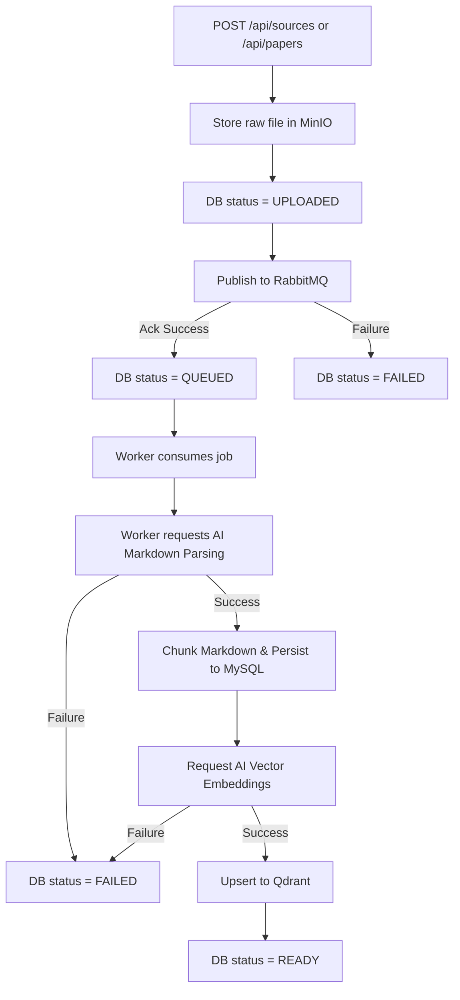

### 4.Automated Claim Evaluation Workflow

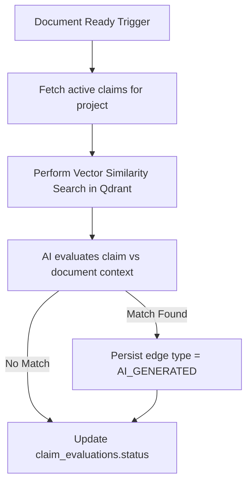

### 5.Manual Mapping & AI Override Workflow

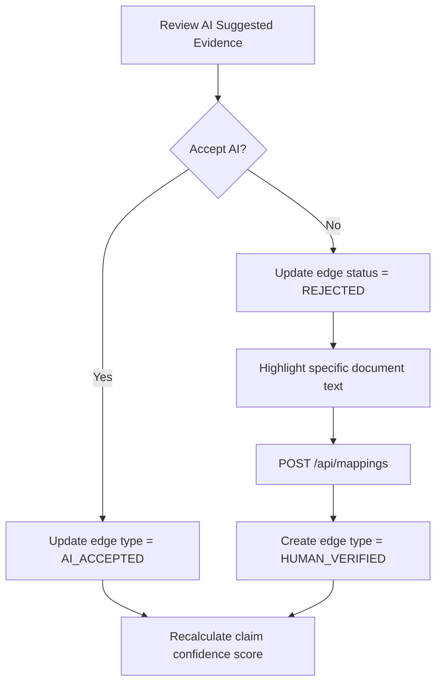

### 6.Project Review & Handoff Workflow

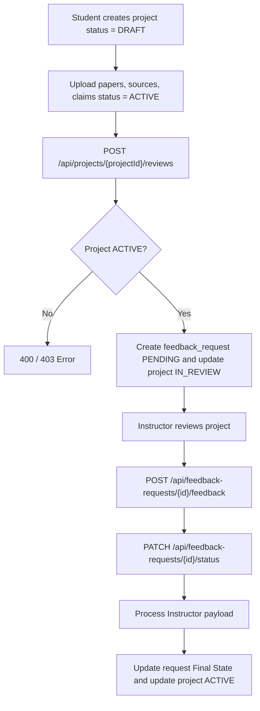

### 7.Traceability Export Generation Workflow
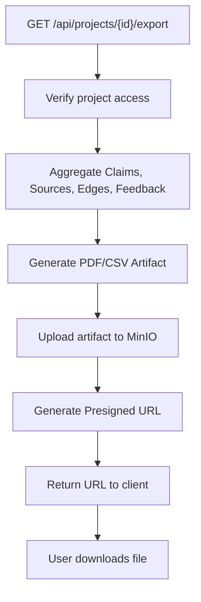

### 8.System Notification & Event Workflow
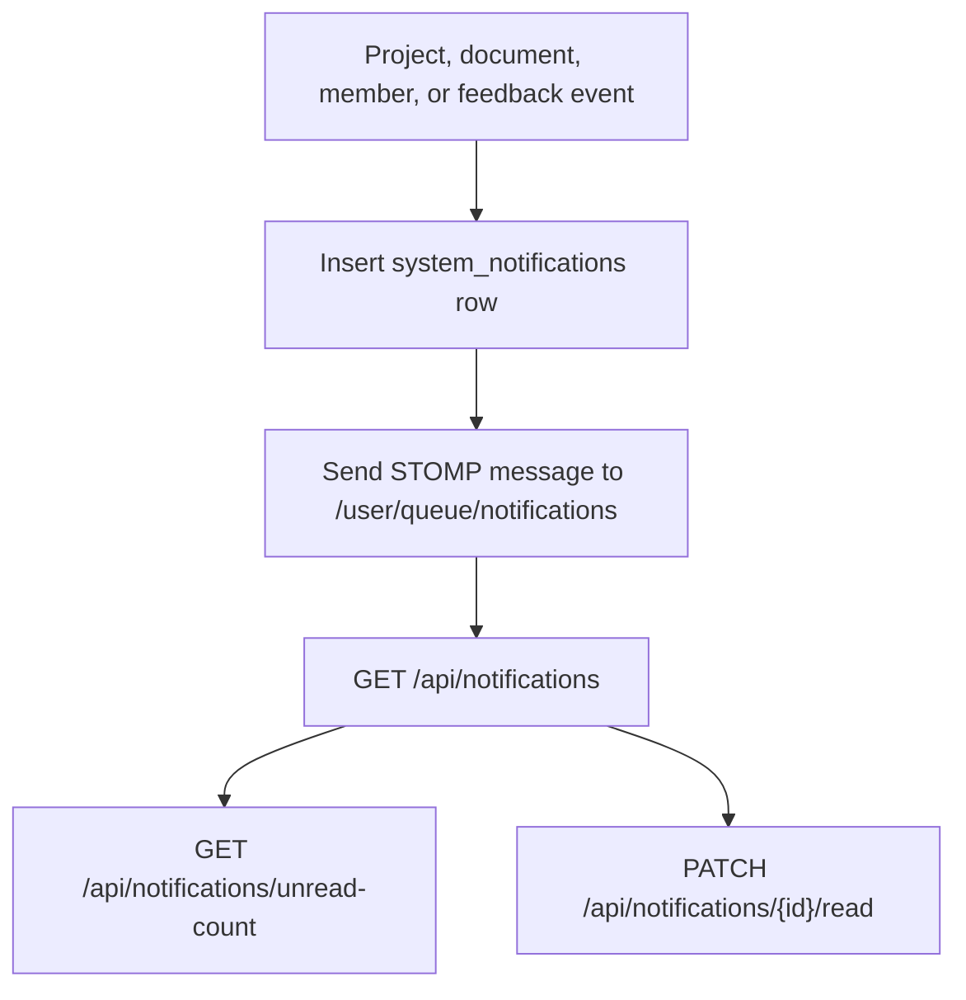

## Entity State Machines

### User Account

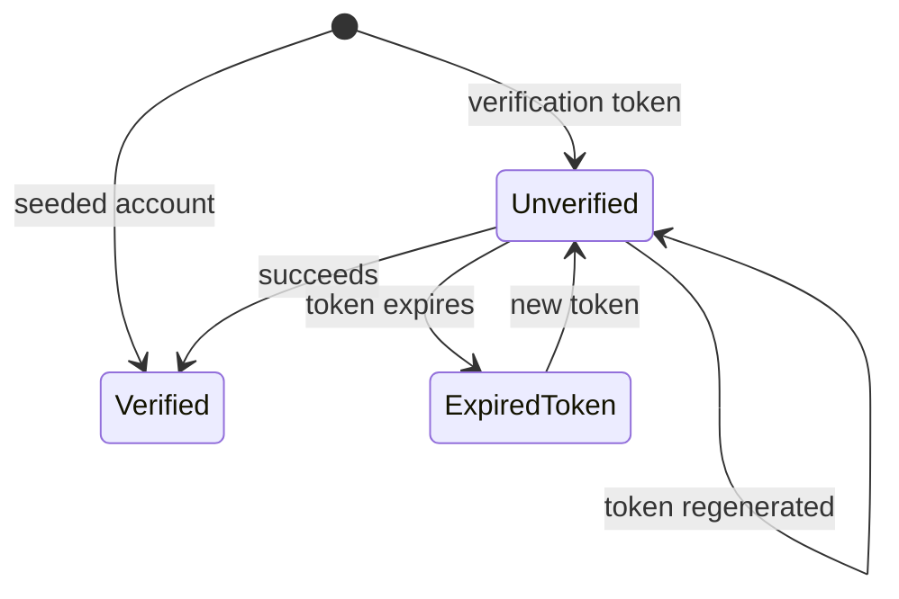

### Project Review

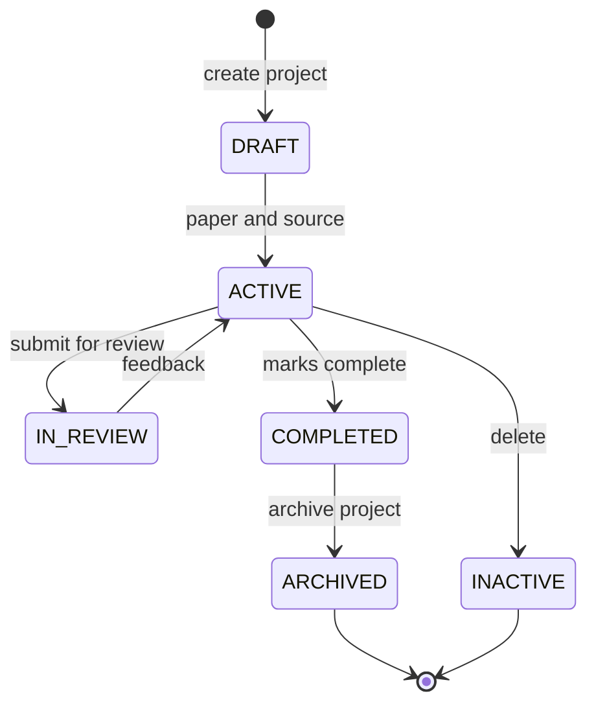

### Document Processing

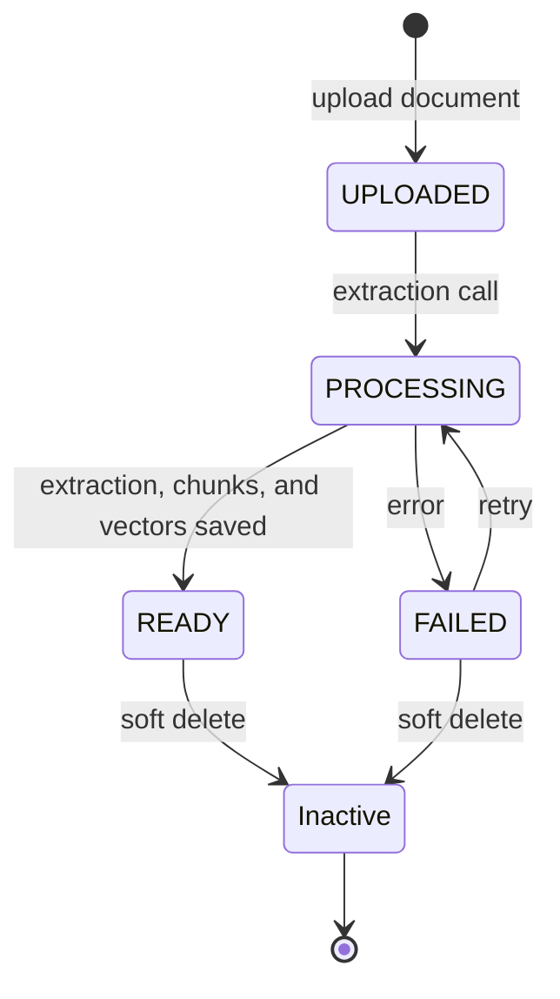

### Claim And Evidence Traceability

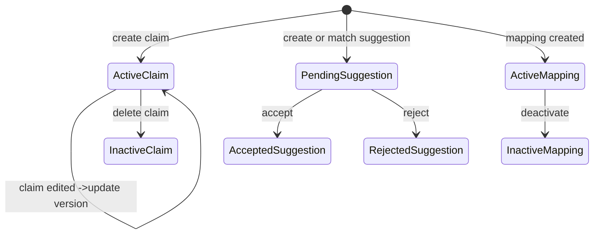

### Feedback Request
RETURNED: sends the work back with feedback.

REVIEWED: has completed the review.

REJECTED: rejects the review/submission/request.

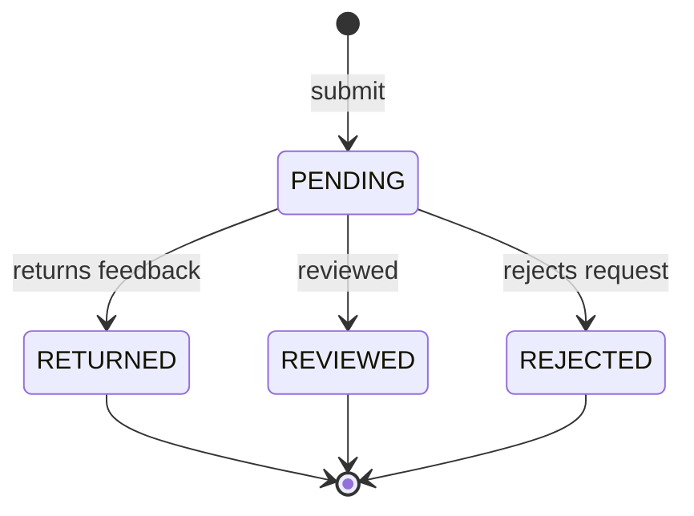

### System Notification

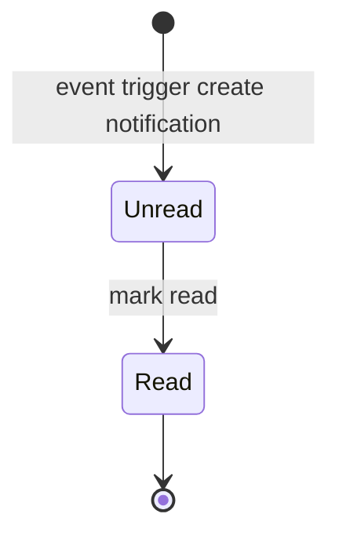

## Logical ERD

SVG without relation: [logical-erd-no-relation.svg](https://www.plantuml.com/plantuml/svg/lLXHRzis47xtho3IXxL3WpPPasP1KTHrxIvOcXH9EcmO1e8HBp9hYTH8oetNxB-FqfaEJKcUq1XzCQpxZiVlEnwFbDuOoxGjysmm5Hn88dIImI236qki8bgaKqkuq91OeUJ0p8Gic6OvoOG4koY0A6sdAW2auc2W88VF0wDcSbOPzqDZmP8PI-7IBZ8WrGnCfXaq7SZN0I5lbUQWHofJcZnwyVBWuF1dPvqeQPUslRsze_sNInl6l5OP7_mx6Fn0JfsUO-84IYliuYafjFhi9ZHF2PESQ9WB-48ikyx03FoiEvyCQFACV4HVz--YzjiXZyP7axt9nF72U6IdTAvcXp13wa4LuH_TTEIOl3qv6rxyyNZly0bvzUhZhwzVEsXtr_r0paJc77uRNen-6LuytZyug5m-eKl1ZFdY9DCfCzF8oy5QPH1O3vu_yH7f7BIu4L3FVNv-EXwUHL32ggMaLir0OlXM4fj6mMqXD1ZAh1lxRdWrlZhvC7O3ReGsbagMX-JsdjViCjO99HgO1Hw5Smldq-kNgywmNuy-INR3CsYcZuD9j2WgHGwy6lz-vOp6CbkQHbOjqobOwb39cUODd2LMp27CThiUPoyBtaidpI6_1hqczqDjwYNQHsbwJT2hgjPEjBssFYiXDp5FL9PXZq3MezNpTYWBQQmk4wis4E-_sFrNhNrrk63hQ-CCMrgQ8bECEnRNYmuFutB0Kg0pMAoj4XOhtD8RaG7kipWJkSY1kgRTiWLntatgRm3uDKjcLCFV9PZbPfmihHTet4uIZ2qvo0TMGsCxxzT2aVt6TGwYUz4ezcG5UDczzEAK3vIJA6aTGL_1FShLB9pCd4fbL-qRPLpMm5bWxoLZSzTWc-cpkXTWySMz1Gd7OnsGWp4iXNlDmb0DZFVPjdZkZrniqCU4gwJCg_GbIaFZe7_dqP53yNW_6eV7kr6bJe2wP46gj81b7clh28sBNZbidd_-kDrce_9gaQPNjvszUT_ekttMqxLuIBTpKjgBfkfojDHPimSgBL8XMTRT2FrcmiWnYg6D-0SSBGkcPlR-vEpAGzMTYPefspyu30OVldY2-Kl0625JsdAVY3n0QwM37JqjvOmcggotUJsXzswvJ1JbTIRCD4OUM3BKmcrKDrVEqgjsV8pkzNQHj6C7l9x6EPsUdxr7zOXXOULWfogwQRMIhJEspdPKcRP45nT4I0wtgmL1ubsxivMbXXlG81DOPthXpLjYkvecOgpP5ngmxheeOKNvU_u2cCO8eQI25Q2f2Izw7olJ9Lgs98GP8r89d6u-SPOqQFrYY5m3Qwmntlbm6vHV0EIS9YoPGe36D_VuaBceNfAFIP8naJybmnDygOIvu22Jvcapglp8C-VeViReLPqwaydaftT7mQbJ1yGiuvYjD72VeFut3IQeizqWKMgg8zI1azFpeKDHDfs3DYugBiCtzY0tZodJ5CnzTGt5vShIIpwowTIstZcw_JfwTwmTRekCIHQSsEq9wQCUX_cgeJah2Y7JOFbzgNn0vBkcOxK8tJue48_o_ZdjaPXLIe2dWFdmgHWxo_VCmnmq5ubjRIj-V_IgaLpW3S1h8_slzNx_-bSJl8gYiVzhIPz6m4extNIdpuI4rU4MNslR6ea6ex8vzBw_rz_ITl-S2iv1_bL_YznT7Py3_oVsmDso77rtjxkhlgv_H1aid_g0mOSC3DWmnmDM_EvT6b3qvX33mKHDkJLmTnTUpoBGZ_AteIOQtq0Q7dYgnxeZe3EFN30Sr0B4Wt2nmh3hIFthJU5nC5ZJsEeHZctjeQqnsZt3m1iTKNYtmpghi9CrsSGURNcAzpuIQCVYv4TVRt3eDs3Hio_H-7j9H6uptFAPul_WDo1vcMV_0G00).

SVG with relation: [logical-erd-relation.svg](https://www.plantuml.com/plantuml/svg/lLbVRzis47_Nfo3SXxL3WpPPasP6KTHrxIvOcXHEEcmO1e6HpZ8RYTH8AedRzBkFqiaiJPc6i1XzoRox7u_t_qxi6wMfr5MHHmkM0acOJ7A8SfXheWMHB5jeaZ89YMQ2H-gQyP9AMf2SST3B4eYGUY4S1XSfA2Z9qNE7A2c_hea7Bh6aoJNDu48lSo3r3PHdENG1v6j4o5iXKv1ZaGj97hruUNXuzAkXJWNNBMr_V__uu6LBGvbN8a-ZRr7q4parzWo9CP1hffTFIId5PtEXUaeeJuc46mQtHDEh75IqkdNmIO4apyX7n9fVimOt88ycnzFzwTJeXVB8e39GDI1KaVfGe_3FvZeo96zFpaQplnxl7pqXhrvz_FtrQyFQspD_eA0iDu0_HhFnRwFPuuF3mnho2I4bLUhMc1mlg5fuACEM8WU7UlZyoKfYV0EIpHaqTv-Vdqv6PnuheNKeOoskWQFuW1BXKt1NCWagfjgSVJUwd5oUV9YO0tCcbOuvBLpbzfytskKqo4eaK0sf9-vRPDtRXWiztCQZbvFDyHowxaj19PALjKM6UJdvyz8GbQQwKXslQYepqB7XyfJAjCEdYMOtu7WxP0yXLPdsiZCkeBW2kMRkXuRKo-YLb2vgYgWwMmFSK6vz5enlqpmHUOuz0hKUs__VZSgCAoshH8kmuls37OvQp-YaZAx7nX1s59eo5pGrMbmj0mYbXQGPnDUmN8iI9YlSnNEM0zQPxuc25H2RfjqjGNjlsFevG7fbMcCiuTyAL5kCqvOwG-9kdA1qbG9_M3Pqo_cWCRJLVfkbZlILqMZiYMMipEvbBrxvG7CImRLHiCtWFkcgbaf34NEXRVj6CouQnfb3xsN6zgv1jwjFcrw0oUVt5bJOFsiO1IX5C_XkCrEn19hsALkS-sCZ6-IGf2AfYjfzYP3G6VJlLjonuU9uFvwuurs9IYOG6sT19YI3reyDTOp4PIyVTkUV7RSxR5GhQr5DQzrEQlDxemzZrjsrV4YtCwPiJfgwoyMLpBizK4YMCKxpO2EqnOIIVIwALkmB6BKqg4QpzoTdboshsPbYjQ07XqVEuQCNJz1_2IZ5U1O7zWa70L8AwLJqekBNSIAgfipnmXQzOPaegwkSgONFUM3An1hklBovD9HUkMDb1EDj94cZ7QJDDGPqUdxs7gr77YPM0NeXl4rhexADnzQr7TUa7QcB0M4yXJiR45GyL9qRjPGm1mayWNLDPoloZhIrrtWQIteREre75oNCg7RFNmALA65j0w8bo5YvYzx7cdI1b1qPGfLYMRrjRfyuhHgna2cqkZfKj35S-N3df9_3AD8ueSa276vuSySXCwi_aeSaoIahdfBH2NvKmWrBWIVTQJEkSUIP0Pe_4qJLKsSwdVxoxjYPEer0z3AUsKK3jmxglsbG5XlQ71MDLJr23NDwUZuoN3Ix_aXKHYg6uN_s87EFgh8CrFVi6h4BI-bbFceJj6szSuHnWTxjsmvtPKuvTIPsm24zhCTZgwo92rgMZ6TE-5UfyW4vFzGTDWX131g8exo_J_iunhe4qWnRgAsQYQ7yI3-OeAOiqTss4gYFO8uK33S0soJwh_Lj_TfF4rn5aTZ_iwHF8w2LNcpRwNF6mGutVwtTr4WaA97VGE_zlNbBs_jxmT8K-3_DM-IU7P_HweUFm6ffJz_Vx-s9hzuZoh1vpb1HIms15jI7ECyQXYzkkRAt-5pxKTUHOVKUDXwYjIREoIugaw8gLUHzRcoGXYps1QnQFWGNRcLzrq3kxzTsFGCRs4MjsNS65k-Bn6rhY9kI2i9cJfBOXEd2rtQ9uIf1qPW0PhKh16EPCcfWHVrVAwSBi8xnnE3SnLHmR_RvDf18GExwz1ewNLH5QmuCuijIIEq9tJWBZ8NuovFSuv3ntTgzsqyCQ990MIS6LGDqwFO3MDwU3Mx_ReHocY-_6A5Nou5dGE24RPnp8GURGkEtn2Rp4c0tjZX2C6nxVYfqNhgC4ks_6qYaM7-4yEsprdQKynWK-Kmirkup51gdIi4LkD8t8sybqvuJkYz2rbrzaBJkSc-0frMH_mS0)

## Database Schema

[https://dbdiagram.io/d/6a44e7394ac62e474c064594](https://dbdiagram.io/d/6a44e7394ac62e474c064594)

## Database Schema Notes

- `documents.doc_type` separates student papers from source evidence documents. Both use the same document storage and extraction pipeline.
- `source_categories` classifies source evidence documents through `documents.source_category_id`.
- `project_members` is the collaboration join table between `projects` and `users`.
- `document_texts` is one-to-one with `documents`; chunks, references, and paper sections are one-to-many.
- `claims` belong to projects and can optionally point to a paper section.
- `ai_suggestions`, `claim_evidence_mappings`, and `evidence_edges` model the traceability flow from AI suggestion to human-approved mapping and analysis result.
- `feedback_requests` connect a project, student, and instructor; each request can have one `instructor_feedbacks` row.

## Technology And Service Stack

| Area | Technologies in current checkout |
| --- | --- |
| Frontend | JavaScript, React 19, React DOM, React Router DOM 7, Axios, Vite 8, Tailwind CSS 4, `@vitejs/plugin-react`; source: `E:/Code/SEP490/EvidencePilot/FE/package.json`. |
| Backend | Java 21, Spring Boot 3.3.5, Spring Web, Spring WebSocket/STOMP, Spring Data JPA, Spring Security, Spring Mail, Spring AMQP, Bean Validation. |
| Persistence and migration | MySQL 8.0.46, Hibernate/JPA, Flyway, `schema.sql` bootstrap for fresh Docker MySQL databases. |
| Storage and async processing | MinIO object storage, RabbitMQ extraction queue, Qdrant vector database. |
| AI integration | External AI worker/model API configured by `AI_MODEL_BASE_URL`; used for extraction, embeddings, claim evaluation, and paper review. |
| API documentation | Springdoc OpenAPI / Swagger UI at `/swagger-ui.html` and OpenAPI JSON at `/v3/api-docs`. |
| Build and test | Maven 3.9 builder image, Spring Boot Maven plugin, Spring Boot Test, H2 test database, Dockerfile multi-stage build. |
| Mobile | N\A |

## Third-Party Services, DevOps Tools, And Environments

| Service/tool | Source/config | Purpose |
| --- | --- | --- |
| GitHub | `origin` remote: `https://github.com/MinhKien17/SEP490_Prototype.git` | Source repository and pull-request hosting. |
| Docker | `Dockerfile` | Builds backend with Maven and runs it on Eclipse Temurin 21 JRE Alpine as non-root `appuser`. |
| Docker Compose | `docker-compose.yml` | Local deployment stack for backend, MySQL, Qdrant, MinIO, RabbitMQ, and init jobs. |
| MySQL | `mysql:8.0.46` Compose service `db` | Relational source of truth. |
| Qdrant | `qdrant/qdrant:latest` Compose service `vector-db` | Dense/sparse vector index for source chunks. |
| MinIO | `minio/minio:latest` Compose service `minio` | Raw document object storage. |
| RabbitMQ | `rabbitmq:3.13-management-alpine` Compose service `rabbitmq` | Async document extraction queue. |
| SMTP provider | `spring.mail.*` environment variables | Sends account verification email. |
| External AI model API | `AI_MODEL_BASE_URL`, optional `AI_MODEL_API_KEY` | Extraction, embeddings, review, and claim evaluation. |

Deployment environments represented in the repository:

| Environment | Evidence | Notes |
| --- | --- | --- |
| Local backend development | `src/main/resources/application.yml` defaults to `localhost` for direct DB and service access where applicable. |
| Local Docker Compose | `docker-compose.yml` binds services to `127.0.0.1` host ports and uses internal service names on `evidence-network`. |
| Production/staging | Not defined in this checkout. Add only when infrastructure manifests, deployment settings, or CI/CD environment configuration exist. |

## Source Control And DevOps

| Item | Current value |
| --- | --- |
| Repository | `https://github.com/MinhKien17/SEP490_Prototype.git` |
| CI/CD workflow files |  |
| Local deploy command | `docker compose up --build` from `E:/Code/SEP490/EvidencePilot/BE` after required `.env` values are set. |
| Fast config check | `docker compose config --quiet` |

Raw Git author participation from `git shortlog -sne --all` on 2026-07-01:

| Commits | Git author |
| ---: | --- |
| 88 | `Adzzse <noik0vshack@gmail.com>` |
| 26 | `MinhKien17 <kiendmse170383@fpt.edu.vn>` |
| 15 | `SE171707_QuangHai <hainqse171707@fpt.edu.vn>` |
| 13 | `hainqse171707 <hainqse171707@fpt.edu.vn>` |
| 12 | `kelvinn0104 <duc142003@gmail.com>` |
| 6 | `Adzzse <134699660+adzzse@users.noreply.github.com>` |
| 2 | `Doan Minh Kien <kiendmse170383@fpt.edu.vn>` |
| 1 | `Nguyen Minh Duc <111220898+kelvinn0104@users.noreply.github.com>` |

Commit counts show repository participation, not man-hours or final contribution percentage.

## Contribution And Effort Tracking

The repository contains commit history but does not contain confirmed weekly man-hours or advisor sign-off. Fill the following ledger from team timesheets, task board history, meeting minutes, or advisor-confirmed records.

| Member | Main role | Week 1 hours | Week 2 hours | Week 3 hours | Week 4 hours | Week 5 hours | Week 6 hours | Total hours | Contribution % | Evidence link/note | GVHD confirmed |
| --- | --- | ---: | ---: | ---: | ---: | ---: | ---: | ---: | ---: | --- | --- |
| Adzzse / noik0vshack |  |  |  |  |  |  |  |  |  |  |  |
| MinhKien17 / Doan Minh Kien |  |  |  |  |  |  |  |  |  |  |  |
| SE171707_QuangHai / hainqse171707  |  |  |  |  |  |  |  |  |  |  |  |
| kelvinn0104 / Nguyen Minh Duc |  |  |  |  |  |  |  |  |  |  |  |

Advisor confirmation summary:

| Confirmed by | Date | Scope confirmed | Signature/note |
| --- | --- | --- | --- |
| GVHD | TBD | Week 1 to Week 6 man-hours and contribution percentages | TBD |
